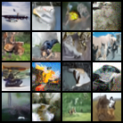
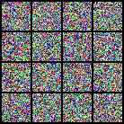
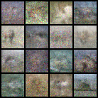

# Minimal implementation of simple, stable, and scalable consistency models

This is based on [cloneofsimo/minRF](https://github.com/cloneofsimo/minRF). 

I can't make it work but maybe you can.

This repo also implements flash attention jvp which you might want to use.

## Results

### TrigFlow

### sCD

sCD 2-step sampling

